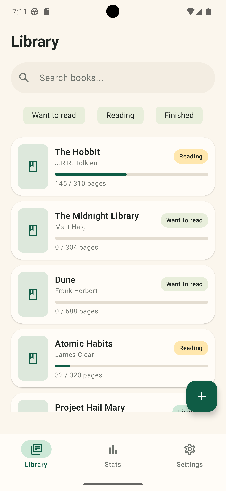
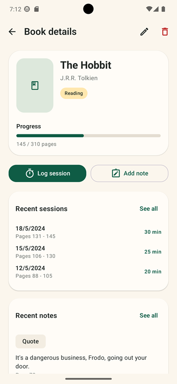
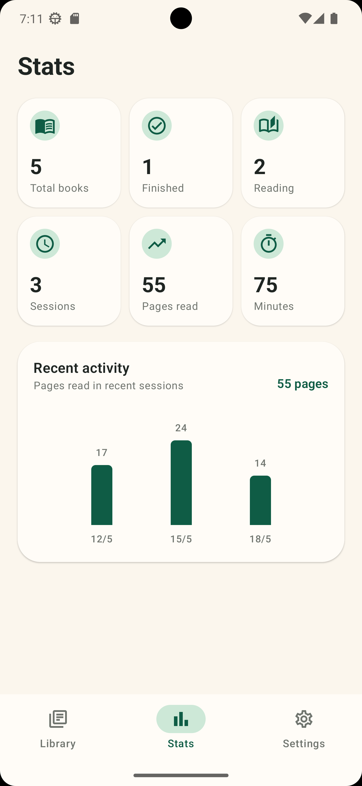
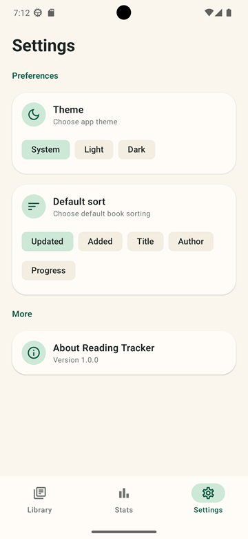

# Reading Tracker

Reading Tracker is a mobile-first book journal app built with **Kotlin Multiplatform** and **Compose Multiplatform**.
The goal of the project is to track books, reading progress, sessions, notes, and basic reading statistics using a clean local-first architecture.

This project was created as a portfolio app focused on Android development, clean architecture, local persistence, testing, and multiplatform code sharing.

## Live Demo

Web demo: **https://pguillen1.github.io/ReadingTrackerKMP/**

> The web version is a portfolio demo presented in a fixed mobile viewport. The app is primarily designed as an Android mobile application.

## Screenshots

| Library | Book Detail | Add Session |
|--------|-------------|-------------|
|  |  |  |

| Notes | Stats | Settings |
|------|-------|----------|
|  |  |  |

## Features

* Local book library
* Add and edit books
* Track book status:

  * Want to Read
  * Reading
  * Finished
* Track current page and total progress
* Register reading sessions
* Add notes and quotes for each book
* View recent sessions and recent notes
* Filter books by reading status
* Search books locally
* Reading statistics:

  * Total books
  * Finished books
  * Currently reading books
  * Total reading sessions
  * Pages read
  * Minutes read
  * Recent reading activity
* Settings with persisted user preferences
* Android launcher icon and app branding
* Web demo deployed with GitHub Pages

## Tech Stack

### Core

* Kotlin
* Kotlin Multiplatform
* Compose Multiplatform
* Jetpack Compose
* Material 3
* Coroutines
* Flow / StateFlow

### Architecture

* Clean Architecture inspired structure
* Presentation / Domain / Data separation
* Repository pattern
* Use cases for business logic
* ViewModels with reactive UI state
* One-shot UI effects for navigation and messages

### Persistence

* SQLDelight for local database storage
* DataStore for user preferences
* Local-first approach
* Fake implementations for the web demo target

### Dependency Injection

* Koin

### Testing

* Unit tests for use cases
* ViewModel tests
* Repository integration tests with SQLDelight
* Android Compose UI tests for screen rendering and user interactions

### CI/CD

* GitHub Actions
* GitHub Pages deployment
* Web demo generated from the Compose Multiplatform WASM distribution

## Web Demo

The web demo is built with Compose Multiplatform and deployed using GitHub Actions to GitHub Pages.

The Android app is the main target, while the web version exists to make the project easier to preview from a portfolio, CV, or GitHub profile.

## Current Status

Version 1 is focused on a complete local-first reading tracker experience:

* Local book management
* Reading progress tracking
* Notes and quotes
* Reading sessions
* Basic statistics
* Settings persistence
* Automated deployment for the web demo
* Unit, ViewModel, integration, and UI test coverage

## Future Improvements

Possible improvements for future versions:

* Book search using an external API
* Book cover support
* Reading goals
* More advanced statistics
* Export/import data
* Notifications or reading reminders
* Better tablet and responsive layouts
* Google Play release
* iOS UI using SwiftUI with shared KMP domain/data logic

## Why This Project

This project was built to demonstrate:

* Practical Android development with Kotlin
* Kotlin Multiplatform project structure
* Compose-based UI development
* Local persistence with SQLDelight and DataStore
* Clean Architecture principles
* Testable business logic
* Automated deployment with GitHub Actions
* A complete mobile app workflow from implementation to portfolio demo
